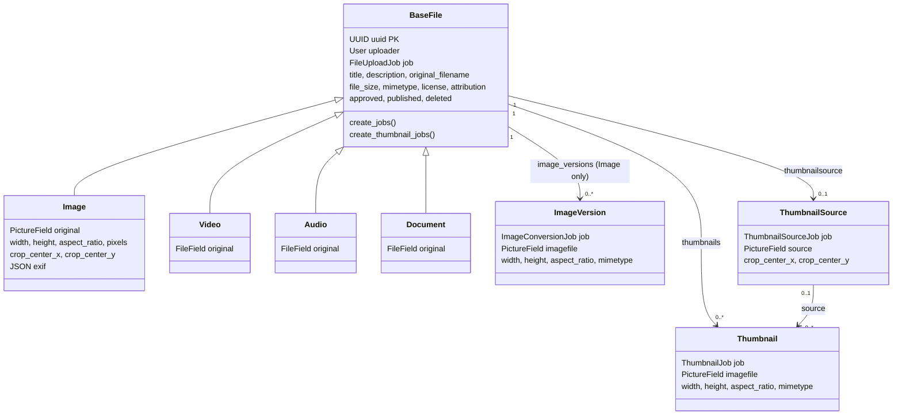

# File and image model

## Core archive model

`files.models.BaseFile` is the polymorphic root for archive items. Its concrete
subclasses are `Image`, `Video`, `Audio`, and `Document`; callers querying the
root normally receive the real subtype through `django-polymorphic`.

It owns the shared archive metadata: UUID primary key and short UUID display
form, uploader, upload job, timestamps, title/description/source, original
filename/size/MIME type, CC license and attribution, moderation/publication/
soft-delete flags, and user-tagged `django-taggit` tags. It also has the file
object permissions used by `django-guardian`. A file is visible either when the
requester has `view_basefile` on it or when it is both approved and published.

The original field lives on each concrete subtype. `Image.original` is a local
`PictureField`; the other concrete subtypes use their own original file fields.
`BaseFile.filename` derives the basename from that subtype field. An upload
first persists the subtype, then creates a completed `FileUploadJob`, associates
it back to `BaseFile.job`, adds tags/object permissions, and invokes
`create_jobs()`.

## Image and rendition records

`images.models.Image` adds image dimensions, a stored aspect-ratio string,
database-persisted `pixels`, crop-center percentages, JSON EXIF, and the
original image. Its `create_jobs()` creates EXIF extraction, full-size alternate
format, smaller responsive-version, and thumbnail jobs as applicable.

`ImageVersion` is a non-polymorphic derivative record. It has a one-to-one
`ImageConversionJob` and points to `files.BaseFile` rather than `Image` so the
prefetch helpers can fetch versions while querying the polymorphic root. It is
unique by `(image, width, height, mimetype)`, ordered widest first, and keeps an
advertised aspect ratio separate from minor rounding in actual dimensions.

`Image.get_versions()` and `get_fullsize_version()` deliberately consume the
prefetched `image_version_list` rather than issuing a query. File list/detail
views call `prefetch_image_version_list()` for this reason. If another caller
uses these methods without that setup, the expected attribute is absent rather
than transparently queried.

## Thumbnail records

`ThumbnailSource` is a one-to-one image input used to generate thumbnails. It
is required for video, audio, and document files; it is optional for an image,
where the original may be used directly. Its field configuration asks for WEBP
versions at 1:1, 4:3, 16:9, and 2:3, up to 200 CSS pixels across four grid
columns at 1x and 2x. The record keeps its own crop center.

`Thumbnail` is the generated artifact. It points to its `BaseFile` and to the
`ThumbnailSource` when one exists; image-direct thumbnails have `source=NULL`.
It is one-to-one with `ThumbnailJob`, unique by `(basefile, width, height,
mimetype)`, and ordered widest first. `BaseFile.get_thumbnails()` groups
prefetched thumbnail records by aspect ratio, MIME type, and width for template
rendering.

Both rendition classes share `ImageModel`: file size, reported MIME type,
width/height, advertised ratio, and persisted `pixels`. These are separate
models rather than subclassing `Image` because the code explicitly avoids mixing
the non-polymorphic image mixin into the polymorphic hierarchy.

## Local django-pictures derivative

The `pictures` app is local source adapted from django-pictures, not a PyPI
dependency. `PictureField` extends Django's `ImageField` and uses a
`PictureFieldFile` to calculate the expected output files. `SimplePicture`
represents one expected rendition and derives a predictable storage name from
the parent filename, optional custom aspect ratio, width, and output type.

The shared `PICTURES` configuration is one 4,000-pixel-wide 12-column container,
native aspect ratio by default (`None`), 1x/2x densities, and WEBP output. The
field-specific thumbnail-source settings override that shared size/grid/ratio
policy. `get_picture_files_list()` therefore tells BMA which image-version or
thumbnail artifacts should exist; it does not generate them. The processor is
configured as `images.picture_processor.dummy_processor`, consistent with the
external-processing boundary.
