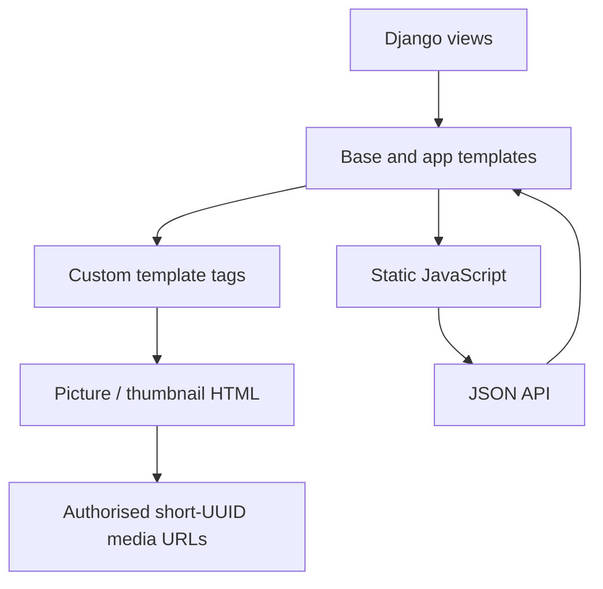

# Frontend and templates

## Rendering model

BMA is a server-rendered Django application with progressive JavaScript. Views
select templates under `src/templates/` and each app's `templates/` directory;
Bootstrap 5 supplies layout/components, `django-tables2` supplies tables,
`django-filter` supplies filter forms, and HTMX middleware is installed. The
repository also ships direct JavaScript integrations for uploads, jobs,
PhotoSwipe, Splide, Dropzone, Compressor.js, EXIF parsing, and the image editor.

`src/templates/base.html` is the shared shell. App templates extend it or a
feature-level template; examples include `files/templates/file_show.html`,
`file_list_grid.html`, `albums/templates/`, `tags/templates/`, and
`jobs/templates/grinder.html`. `widgets/templates/` renders embeddable
gallery/PhotoSwipe/Splide fragments, and `templates/allauth/` overrides
allauth's layouts/elements.

## Media rendering

`utils.templatetags.bma_utils` is the BMA presentation bridge.

| Tag | Current behavior |
| --- | --- |
| `` | Selects the image `picture` tag or audio/video/document include according to `filetype`. |
| `` | Finds a prefetched WEBP thumbnail at a supported width/ratio, emits 1x/2x markup, or returns the configured file-type placeholder. |
| `` | Groups prefetched `ImageVersion` records and produces a width-descriptor `srcset` for an image/MIME/aspect-ratio request. |
| `` | Converts grid breakpoint arguments into a responsive `sizes` string. |
| `` / `` | Produces simple linked fallback markup or widget script markup. |

`pictures.templatetags.pictures.picture` renders a `<picture>` element using
the local `pictures/picture.html` template. It gathers version querysets by MIME
type for a requested aspect ratio and emits `<source srcset>` elements followed
by an `` pointing at the original. The image list and detail views prefetch
versions and thumbnails to support this pattern.

File detail views use PhotoSwipe markup and pass original, full-size WEBP,
dimensions, and `srcset` data. Grid/gallery templates use the thumbnail tag and
the same PhotoSwipe integration. If a rendition is not finished, templates can
still fall back to the original or a static file-type thumbnail, depending on
the tag/path used.

## Browser-side flows

The upload page uses Dropzone and `upload.js`; it builds multipart API requests
with original metadata and may create/client-crop a thumbnail source before
uploading. `uploadClient.js` is shared by upload and grinder flows. It owns an
OAuth client, file/job queues, job polling/assignment, in-browser conversion
through Compressor.js, and result submission.

The grinder template (`jobs/templates/grinder.html`) exposes Start/Stop controls,
progress, and a log. It loads the browser worker's dependencies and
`grinder.js`, which continuously asks for work while running. The UI is thus a
worker implementation as well as an administration page; see
[image processing](image-processing.md) for its supported job boundary.

Static source assets live in `src/static_src/` and are served from `STATIC_URL`;
`src/assets/css/` contains the CSS package metadata. `STATIC_ROOT` is the
collection destination. Media is different: templates use the short media URLs
created by `BmaFileSystemStorage`, and every such request re-enters BMA's
authorized media view before the development server or nginx delivers bytes.
