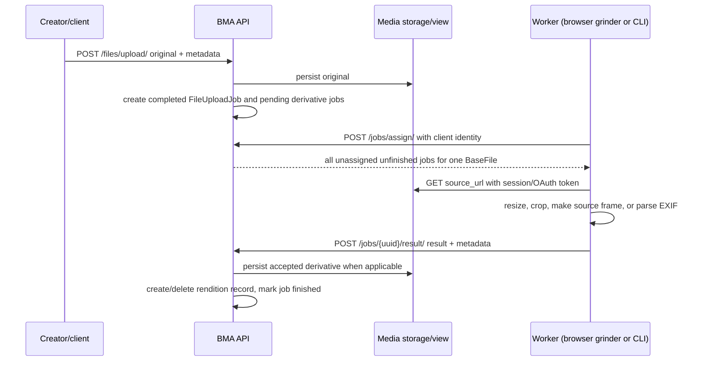

# Image processing and jobs

## Processing contract

BMA persists work as polymorphic `jobs.models.BaseJob` records. A job contains
its UUID, parent `BaseFile`, source URL, optional assigned worker user/client
UUID/version, timestamps, and completion state. The API is the contract with
the processor; a worker need not share BMA's filesystem or process space.

`POST /jobs/assign/` is restricted to users with the worker role. It clears
unfinished assignments older than 24 hours, then assigns every unassigned,
unfinished job for the first available file to one requester. This grouping lets
one processor retain/fetch the source once for a file. Job result submission is
also worker-only and requires an unfinished job UUID. The server validates
image metadata before it writes a rendition, then records the worker identity
and marks the job finished.

The browser grinder (`/jobs/grinder/`) uses `static_src/js/uploadClient.js`.
It obtains OAuth credentials, claims jobs, caches fetched input blobs by source
URL, uses Compressor.js to resize or crop, and uploads results. Its EXIF branch
is presently commented out; an external CLI that supports the API can perform
that job. The JavaScript worker only processes sources that are images. For
non-image source media, it cannot fulfil the corresponding thumbnail-source
job and unassigns it, which is why the external CLI boundary is operationally
significant.

## Job types and results

| Job class | Created for | Worker output | Server-side result handling |
| --- | --- | --- | --- |
| `FileUploadJob` | Every accepted original upload. | None; it records the upload. | Already finished; `result_url()` is the original. |
| `ImageExifExtractionJob` | Images whose `exif` field is `NULL`. | JSON EXIF file. | Loads JSON into `Image.exif`. |
| `ImageConversionJob` | Images: full-size selected output formats and required smaller responsive outputs. | Image at requested width/height/type, crop behavior, and metadata. | Validates and writes an `ImageVersion`; deletes a pre-existing record at the same image/dimensions/MIME first. |
| `ThumbnailSourceJob` | Video, audio, and document files lacking a `ThumbnailSource`. | Representative image/frame plus dimensions/MIME metadata. | Replaces the existing `ThumbnailSource` in a transaction, then creates needed thumbnail jobs. |
| `ThumbnailJob` | All files once an image or thumbnail source is available. | Requested thumbnail image plus metadata. | Replaces the same `(file, width, height, MIME)` thumbnail transactionally; attaches its source when present. |

`ImageJob` supplies the conversion specification used by the two image-output
jobs: requested width, height, output extension, optional custom aspect ratio,
and 0–100 crop-center coordinates. It derives the output MIME type from
`ALLOWED_IMAGE_TYPES`. The server's image result schema receives width, height,
and MIME type from the worker; model validation and uniqueness constraints
protect the persisted result.

## Image workflow

For an image upload, BMA stores the original and calculates `aspect_ratio` from
the upload's dimensions. `Image.create_jobs()` then:

1. creates an EXIF job when metadata is missing;
2. creates a full-size `ImageConversionJob` for each configured output type if
   the matching full-size version is absent;
3. calculates smaller native-ratio `PictureField` candidates and creates jobs
   for files not present on disk; and
4. calculates thumbnail candidates from the original image, using the image's
   crop center.

For video/audio/document uploads, `BaseFile.create_jobs()` first requests a
thumbnail source unless one accompanied the upload. Once the source arrives,
the server calculates the thumbnail candidates from it. An upload may include
`thumbnail_data` and thumbnail metadata, in which case it creates a completed
`ThumbnailSourceJob` and source during the original upload path.

`get_or_create()` prevents duplicate unfinished work for the same configured
job fields, and physical-file existence skips creating some image/thumbnail
jobs. Result handling deletes a competing existing derivative only after the
new object has passed validation (inside the documented transaction for
thumbnails and thumbnail sources).

## Processor settings and limits

`GET /jobs/settings/` publishes supported input MIME type mappings, licenses,
and `IMAGE_ENCODING` (currently WEBP quality 90, lossy) to clients. The
repository's development environment permits JPEG, BMP, GIF, SVG, TIFF, PNG,
and WEBP originals, selected video/audio formats, and plain text/PDF documents.
`PICTURES["FILE_TYPES"]` currently contains only `WEBP`, so the configured
derivative target is WEBP even though the accepted original formats are wider.

No task queue, broker, subprocess runner, or server-side image encoder is
present in the inspected project. The durable job table is the hand-off and
recovery mechanism; successful processing depends on a compatible, authorized
worker being available.
