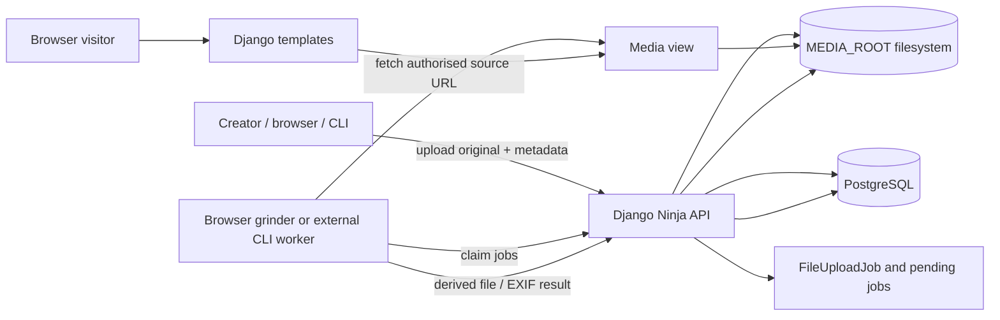

# BMA architecture overview

## Scope and shape

BMA is a Django 5.2 media archive. It stores uploaded originals and metadata,
controls access at the object level, records work that must be done on media,
and serves the resulting files. It does **not** encode images, extract EXIF, or
create thumbnail-source frames in Django. Those operations occur in an
authenticated external client (the browser worker is bundled here; the CLI is
an external consumer of the same API).

The Django project is configured in `src/bma/settings.py` and routes in
`src/bma/urls.py`. Its local applications provide users, files, image/video/
audio/document subtypes, jobs, albums, tags, widgets, permissions, hit counts,
and presentation utilities. The JSON API is mounted at `/api/v1/json/`; the
browser UI uses Django templates under `src/**/templates/`.

### Major boundaries

| Boundary | Current responsibility |
| --- | --- |
| Django application | Validation, persistence, authorization, job creation/assignment/result acceptance, HTML/API responses. |
| PostgreSQL | Model state, polymorphic type metadata, object permissions, tags, albums, and jobs. The development service is PostGIS 14, although the inspected model code uses PostgreSQL range types rather than GIS fields. |
| `MEDIA_ROOT` | Original uploads and accepted derivative files. `BmaFileSystemStorage` makes opaque short-UUID URLs for these paths. |
| Web server | Production media is authorized by Django then internally handed to nginx through `X-Accel-Redirect`; development streams through Django. |
| External processor | Reads the server-issued job description, obtains the source through the authorized media endpoint, does conversion/cropping/EXIF work, and POSTs the result. Django does not invoke ffmpeg, Pillow, ImageMagick, or a queue worker. |

## Storage and delivery

Every media field uses `utils.storage.BmaFileSystemStorage`. Physical names are
deterministic beneath `MEDIA_ROOT`, while public URLs hide that directory layout:

| Asset | Physical path pattern | Public URL prefix |
| --- | --- | --- |
| Original | `user_<u>/<type>/bma_<type>_<file>.<ext>` | `oi`, `ov`, `oa`, or `od` |
| ThumbnailSource | `user_<u>/<type>/bma_<type>_<file>/thumbnailsource_<id>.<ext>` | `ts` |
| ImageVersion | `user_<worker>/image/bma_image_<image>/<ratio>/imageversion_<width>w_<id>.<ext>` | `iv` |
| Thumbnail | `user_<worker>/<type>/bma_<type>_<file>/thumbnails/<ratio>/thumbnail_<width>w_<id>.<ext>` | `t` |

`files.views.bma_media_view()` decodes the short UUID, finds the database
object, checks that the parent `BaseFile` is permitted to the requester, then
either returns an nginx internal redirect or a development `FileResponse`.
Consequently, media URLs are stable handles but not public-object storage URLs:
authorization remains in the request path.

`django-cleanup` deletes files following model deletion; the `cleanup_post_delete`
hook in `utils.apps` removes empty `MEDIA_ROOT` directories afterwards. Model
relationships use `NP_CASCADE` for the archive's dependent records, so a media
object's jobs and rendition records are also removed with it.

## Current dependency status and Django 6 assessment

Status below is an inspection of `pyproject.toml`, imports/settings, and the
current repository configuration on 30 August 2026. “Needed” means the checked
source directly uses it or enables it in Django; it does not claim an alternative
could not be built. “Update” means an upgrade is needed for the Django 6 move,
or that the exact pin is behind a currently published compatible release.

### Immediate Django 6 roadblocks

1. **Python 3.11 blocks the upgrade.** Django 6 supports Python 3.12–3.14 and
   Django 5.2 is the last release supporting 3.11. This repository declares
   `requires-python >=3.11`, uses `python:3.11-slim-bullseye` in
   `docker/Dockerfile`, and has a `py311` tox environment. Move the supported
   baseline and test/deployment image to Python 3.12 or later before resolving
   Django 6. [Django 6 release notes](https://docs.djangoproject.com/en/6.0/releases/6.0/)
   confirm this requirement.
2. **The Django pin must change.** `Django==5.2.14` cannot resolve to Django 6.
   The project already sets `DEFAULT_AUTO_FIELD`, uses keyword `save()` calls,
   and the inspected source does not call Django 6's removed APIs. A full test
   run is still required after the dependency resolution because permissions,
   polymorphic querying, API schemas, and templates are integration-heavy.
3. **Polymorphic querying is an upgrade hotspot.** `utils/polymorphic_related.py`
   copies internal `django-polymorphic`/Django queryset state and is based on an
   upstream pull request. It is local compatibility-sensitive code, so it needs
   focused list/detail/API prefetch tests under Django 6 even if package
   installation succeeds.
4. **Use modern compatible pins for the framework-facing packages.** In
   particular, update `django-oauth-toolkit` from 3.2.0 (3.4.0 explicitly lists
   Django 6.0), `django-polymorphic` from 4.11.2 (newer 4.11 releases exist),
   and `django-ninja` from 1.6.0 (newer 1.6 releases list Django 6). The current
   `django-filter` 25.2 already added Django 6.0 testing. Verify
   `django-guardian` against its selected release: the current PyPI classifiers
   do not list Django 6, and object permissions are core BMA behavior.

Django 6 introduces a task framework, but that does not remove BMA's existing
external worker boundary: Django's own documentation likewise says task
execution belongs to external worker infrastructure. This is an observation,
not a migration recommendation. [Django tasks](https://docs.djangoproject.com/en/6.0/releases/6.0/)

### Runtime dependencies

| Dependency (pinned) | Purpose in BMA | Needed now? | Update/Django 6 status |
| --- | --- | --- | --- |
| `Django==5.2.14` | Web framework, ORM, templates, auth, storage base classes. | Yes | Required upgrade target; Django 6 also requires Python 3.12+. |
| `django-allauth[socialaccount]==65.16.1` | Local account flow and BornHack OpenID Connect social login. | Yes | Update to a current 65.19.x release when resolving; current releases list Django 6. |
| `django-bootstrap5==26.2` | Template tag library and Bootstrap form rendering. | Yes | Check its resolved Django 6 support during the upgrade; no local compatibility shim. |
| `django-cleanup==9.0.0` | Deletes model-backed files; BMA also hooks its post-delete signal. | Yes | Re-resolve/test with Django 6. |
| `django-cors-headers==4.9.0` | CORS middleware and origin settings for browser/API clients. | Yes | Re-resolve/test with Django 6. |
| `django-decorator-include==3.3` | Applies OAuth decorators to OAuth Toolkit endpoint patterns. | Yes | Small but framework-facing; verify under Django 6. |
| `django-filter==25.2` | FilterSets for file, tag, album, and job UIs/APIs. | Yes | No mandatory version change for 6.0: 25.2 added Django 6 testing. |
| `django-guardian==3.3.0` | Per-object file/album permissions and backend. | Yes | Update to current 3.3.x and treat compatibility as a release gate; latest PyPI classifiers inspected do not yet advertise Django 6. |
| `django-htmx==1.27.0` | HTMX request middleware. | Yes | Re-resolve/test with Django 6. |
| `django-ninja==1.6.0` | Typed JSON API, schemas, routers, uploaded-file handling. | Yes | Update to current 1.6.x; recent releases list Django 6. |
| `django-stubs-ext==5.2.9` | Runtime `monkeypatch()` for django-stubs typing support. | Yes, as currently imported in settings | Align to a Django 6-compatible stubs release; it is not merely a development extra here. |
| `django-tables2==2.8.0` | Server-rendered list tables/pagination. | Yes | Re-resolve/test with Django 6. |
| `django-oauth-toolkit==3.2.0` | OAuth2/OIDC server, tokens, worker/browser API auth. | Yes | Update to 3.4.0 or current compatible release; 3.4.0 explicitly supports Django 6.0. |
| `django-polymorphic==4.11.2` | `BaseFile` and `BaseJob` subtype loading. | Yes | Update to a current 4.11.x, then exercise the local related-polymorphic extension. |
| `django-taggit==6.1.0` | Tags and tag manager base classes. | Yes | Re-resolve/test with Django 6. |
| `demoji==1.1.0` | Converts emoji to descriptions while generating tag slugs. | Yes | No Django coupling; retain unless tag-slug behavior changes. |
| `environs[django]==14.6.0` | Reads environment configuration and database URL. | Yes | No direct Django 6 concern; retain. |
| `fontawesomefree==6.6.0` | Installed Font Awesome assets/template integration. | Yes | Asset dependency; optional only if templates/assets are changed, which is outside this assessment. |
| `orjson==3.11.7` | Ninja request parser and response renderer. | Yes | No Django coupling; retain and re-resolve for Python 3.12. |
| `psycopg2-binary==2.9.11` | PostgreSQL driver and `DateTimeTZRange` import. | Yes | Django 6 documents psycopg2 2.9.9+ as Python-3.12-compatible; this pin meets that floor. |
| `shortuuid==1.0.13` | Compact UUIDs for paths, media URLs, and display. | Yes | No Django coupling; retain. |

`pictures` is deliberately **not** an external dependency: `src/pictures/` is a
local implementation derived from django-pictures. It supplies `PictureField`,
the rendition-path calculation, the `` tag, and its templates. It
must be included in the Django 6 test matrix as BMA code.

### Development and test dependencies

| Dependency (pinned) | Purpose | Needed now? | Django 6 action |
| --- | --- | --- | --- |
| `pre-commit`, `setuptools_scm` | Local checks and package versioning. | Yes for development/release workflow | Refresh independently as desired; not runtime blockers. |
| `beautifulsoup4` | HTML assertions in tests. | Yes for test suite | Re-resolve on Python 3.12. |
| `coverage`, `pytest-cov` | Coverage measurement. | Yes for test suite | Update/re-resolve for the new interpreter. |
| `django-debug-toolbar` | Optional development debug UI. | Yes when `DEBUG_TOOLBAR` is enabled | Choose a Django 6-compatible release before enabling it under the new stack. |
| `factory-boy`, `pytest-django`, `pytest-randomly`, `tox` | Test data, Django/pytest integration, order randomization, and environment orchestration. | Yes for the current test workflow | Add Python 3.12+ environments and update pins as resolution requires. |

The report intentionally does not propose removing dependencies or replacing the
job design. It identifies the current use sites and upgrade checks only.
